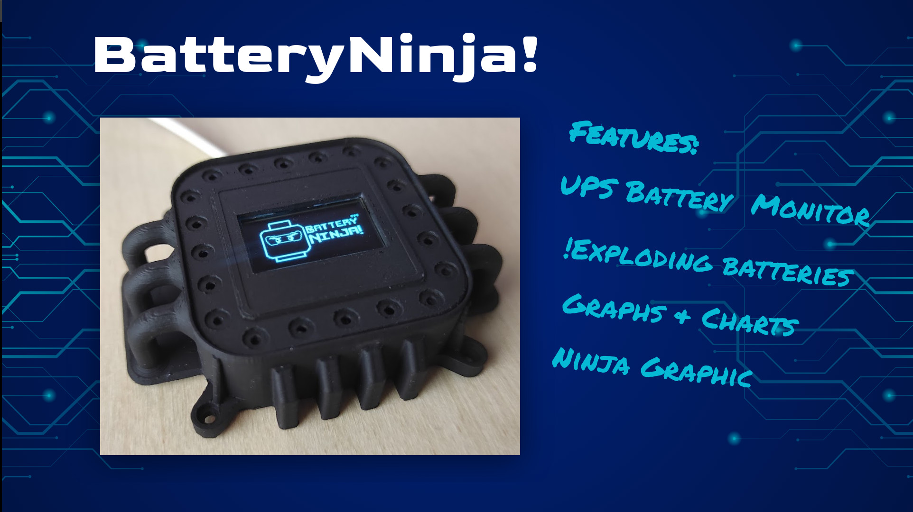

# batteryNinja!
A thing that monitors your UPS battery health and helps it not explode

## Components
- NodeMCU or ESP8622 module
- ds18b20 Temperature Sensor
- Resistor for a resistor divider with a 1:10 ratio

